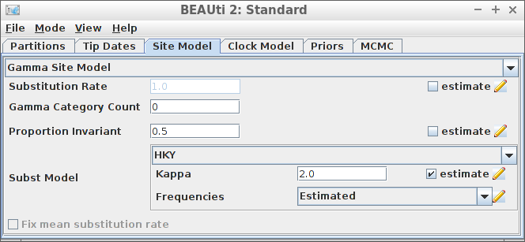

# Examples

For all examples, do load `beastscriptr`:

```
library(beastscriptr)
```

All examples read the alignment from a FASTA file (usually `my_fasta.fas`) 
and create a BEAST2 input file called `my_beast.xml`.

## Example #1

Using all default settings, only specify a DNA alignment.


```
create_beast2_input_file(
  "test_output_0.fas",
  "my_beast.xml"
)
```

All other parameters are set to their defaults, as in BEAUti.

## Example #2: fixed crown age

Using all default settings, only specify a DNA alignment.

```
[No screenshot, as this cannot be done in BEAUti yet]
```

```
create_beast2_input_file(
  "my_fasta.fas",
  "my_beast.xml",
  fixed_crown_age = TRUE,
  initial_phylogeny = fasta_to_phylo(
    fasta_filename = "my_fasta.fas",
    crown_age = 15)
)
```

`fasta_to_phylo` creates a random phylogeny from
a FASTA file of a certain crown age. 

## Example #3: JC69 site model


```
create_beast2_input_file(
  "my_alignment.fas",
  "my_beast.xml",
  site_models = create_jc69_site_model()
)
```

## Example #4: Relaxed clock log normal


```
create_beast2_input_file(
  "my_alignment.fas",
  "my_beast.xml",
  clock_models = create_rln_clock_model()
)
```

## Example #5: Birth-Death tree prior


```
create_beast2_input_file(
  "my_alignment.fas",
  "my_beast.xml",
  tree_priors = create_bd_tree_prior() 
)
```

## Example #6: HKY site model with a non-zero proportion of invariants



```
create_beast2_input_file(
  "my_alignment.fas",
  "my_beast.xml",
  site_models = create_hky_site_model(
    gamma_site_model = create_gamma_site_model(proportion_invariant = 0.5)
  )
)
```

Thanks to Yacine Ben Chehida for this use case

## Example #7: Strict clock with a known clock rate


```
create_beast2_input_file(
  "my_alignment.fas",
  "my_beast.xml",
  clock_models = create_strict_clock_model(rate = 0.5) 
)
```

Thanks to Paul van Els and Yacine Ben Chehida for this use case.
