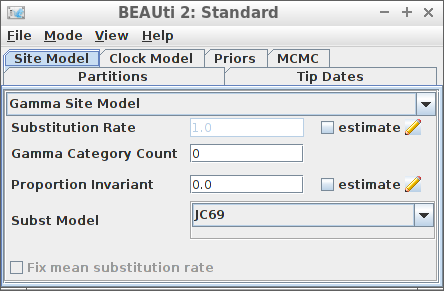
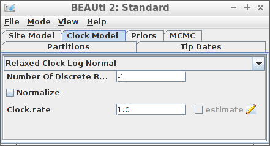
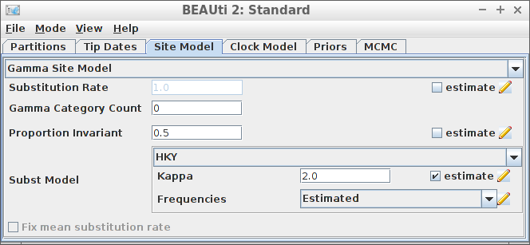
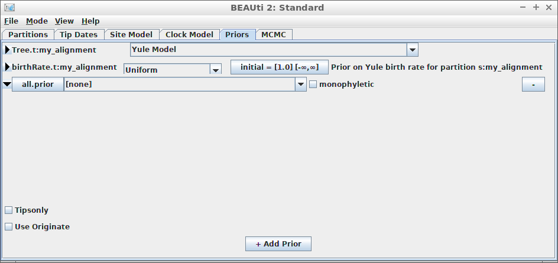
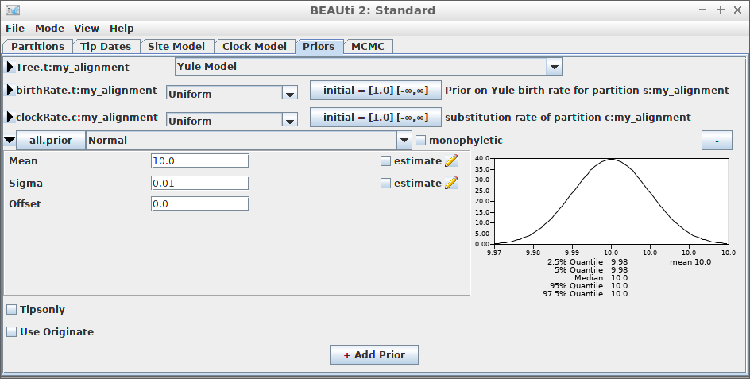
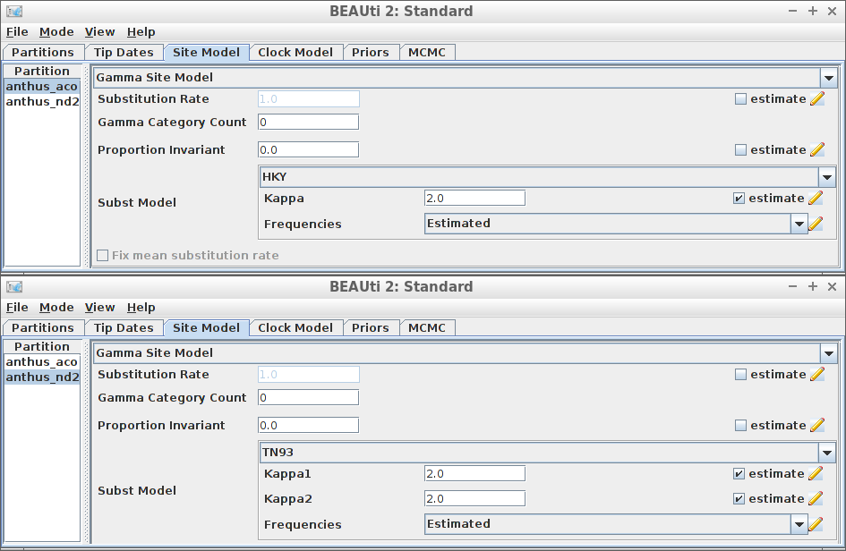

# Examples

For all examples, do load `beautier`:

```{r load_library}
library(beautier)
```

All examples read the alignment from a FASTA file (usually `my_fasta.fas`) 
and create a BEAST2 input file called `my_beast.xml`.

## Example #1: all default

Using all default settings, only specify a DNA alignment.


```{r example_1}
create_beast2_input_file(
  "test_output_0.fas",
  "my_beast.xml"
)
```

All other parameters are set to their defaults, as in BEAUti.

## Example #2: fixed crown age

Using all default settings, only specify a DNA alignment.

```
[No screenshot, as this cannot be done in BEAUti yet]
```

```{r example_2}
create_beast2_input_file(
  "my_fasta.fas",
  "my_beast.xml",
  posterior_crown_age = 15
)
```

`fasta_to_phylo` creates a random phylogeny from
a FASTA file of a certain crown age. 

## Example #3: JC69 site model



```{r example_3}
create_beast2_input_file(
  "my_alignment.fas",
  "my_beast.xml",
  site_models = create_jc69_site_model()
)
```

## Example #4: Relaxed clock log normal



```{r example_4}
create_beast2_input_file(
  "my_alignment.fas",
  "my_beast.xml",
  clock_models = create_rln_clock_model()
)
```

## Example #5: Birth-Death tree prior


```{r example_5}
create_beast2_input_file(
  "my_alignment.fas",
  "my_beast.xml",
  tree_priors = create_bd_tree_prior() 
)
```

## Example #6: Yule tree prior with a normally distributed birth rate


```{r example_6}
create_beast2_input_file(
  "my_alignment.fas",
  "my_beast.xml",
  tree_priors = create_yule_tree_prior(
    birth_rate_distr = create_normal_distr()
  ) 
)
```

Thanks to Yacine Ben Chehida for this use case

## Example #7: HKY site model with a non-zero proportion of invariants



```{r example_7}
create_beast2_input_file(
  "my_alignment.fas",
  "my_beast.xml",
  site_models = create_hky_site_model(
    gamma_site_model = create_gamma_site_model(prop_invariant = 0.5)
  )
)
```

Thanks to Yacine Ben Chehida for this use case

## Example #8: Strict clock with a known clock rate


```{r example_8}
create_beast2_input_file(
  "my_alignment.fas",
  "my_beast.xml",
  clock_models = create_strict_clock_model(
    clock_rate_param = create_clock_rate_param(value = 0.5)) 
)
```

Thanks to Paul van Els and Yacine Ben Chehida for this use case.

## Example #9: Use MRCA prior



Since `v1.13` it is supported to specify 
an MRCA ('Most Recent Common Ancestor') prior.

```{r example_9}
create_beast2_input_file(
  "my_alignment.fas",
  "my_beast.xml",
  mrca_priors = create_mrca_prior(
    alignment_id = get_alignment_id("my_alignment.fas"),
    taxa_names = get_taxa_names("my_alignment.fas")
  )
)
```

To use that MRCA prior to calibrate the crown age to 10 time units:



```{r example_9_fixed_crown_age}
create_beast2_input_file(
  "my_alignment.fas",
  "my_beast.xml",
  mrca_priors = create_mrca_prior(
    alignment_id = get_alignment_id("my_alignment.fas"),
    taxa_names = get_taxa_names("my_alignment.fas"),
    mrca_distr = create_normal_distr(
      mean = create_mean_param(value = 10.0),
      sigma = create_sigma_param(value = 0.01)
    )
  )
)
```

## Example #10: Two alignments


```{r example_10}
create_beast2_input_file(
  c("anthus_aco.fas", "anthus_nd2.fas"),
  "my_beast.xml"
)
```

Thanks to Paul van Els for this use case and supplying these FASTA files.

## Example #11: Two alignments, different site models



```{r example_11}
create_beast2_input_file(
  c("anthus_aco.fas", "anthus_nd2.fas"),
  "my_beast.xml",
  site_models = list(
    create_hky_site_model(), 
    create_tn93_site_model()
  )
)
```

Since `v1.12` this it is supported to have two alignments with different site models, clock models and tree priors.

Thanks to Paul van Els for this use case.

## Example #12: Two alignments, shared clock model

[Example 12: shared clock model](aco_nd2_same_clock_model.png)

```{r example_12}
create_beast2_input_file(
  c("anthus_aco.fas", "anthus_nd2.fas"),
  "my_beast.xml",
  clock_models = list(
    create_strict_clock_model(id = "anthus_aco"), 
    create_strict_clock_model(id = "anthus_aco")
  )
)
```

From `v1.13`, it will be supported to have two alignments with shared site models, clock models and tree priors.

Thanks to Yacine Ben Chehida for this use case.

